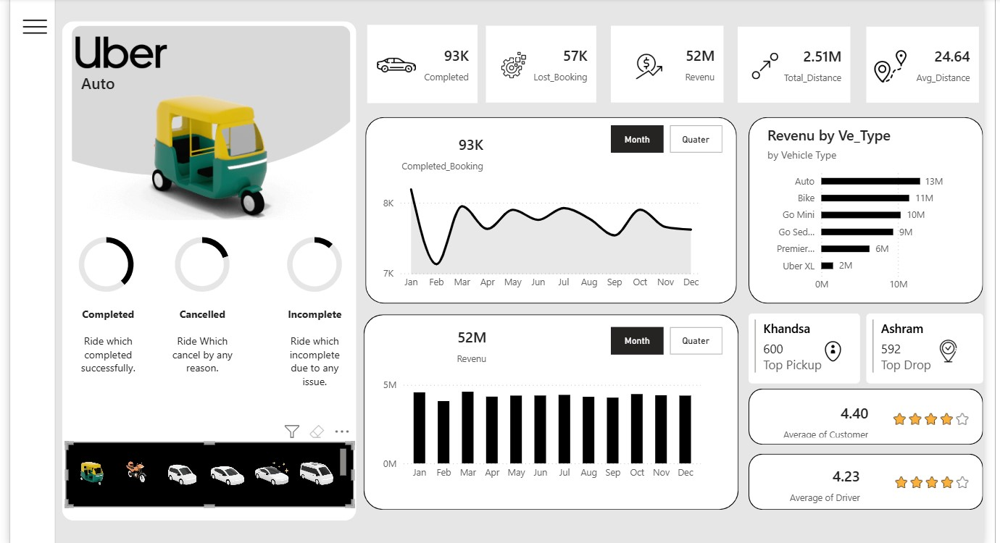

# Uber
# 🚖 Uber Power BI Dashboard

---

## 🌍 Overview

An interactive **Power BI Dashboard** built using Uber trip data — providing insights into demand, routes, drivers, and revenue across time and locations.

🎯 **Goal:** Deliver clear, data-driven insights to help understand service performance and improve decision-making.

---

## 📊 Dashboard Highlights

* 🚗 **Completed Bookings:** 93K total rides completed.
* 💸 **Revenue:** 52M total revenue generated.
* 🛵 **Vehicle Types:** Auto, Bike, Go Mini, Sedan, and Uber XL.
* 📈 **Top KPIs:** Total Distance (2.51M km), Avg Distance (24.64 km).
* 🌆 **Top Locations:** Khandsa (Top Pickup), Ashram (Top Drop).
* ⭐ **Ratings:** Average Customer Rating – 4.40 | Driver Rating – 4.23.

---

## ⚙️ Requirements

* **Power BI Desktop** (latest version recommended).
* Uber trip dataset (CSV/Excel or SQL connection). If not available, a sample dataset can be used in the `data/` folder.

---

## 🧭 How to Run the Report

1. Clone or download the repository.
2. Open `Uber.pbix` using **Power BI Desktop**.
3. Update the data source path if prompted:

   * Go to *File → Options and settings → Data source settings → Change Source.*
   * Point to your local data source or database.
4. Click **Refresh** in Power BI to load the latest data.

---

## 🧱 Suggested Data Model

* **Trips** — trip_id, driver_id, start_time, end_time, origin, destination, distance, fare, rating.
* **Drivers** — driver_id, name, vehicle_type, join_date.
* **Zones** — zone_id, name, latitude, longitude.

💡 *Adjust table relationships in Power BI based on your dataset structure.*

---

## 📈 Key Analytics

* 🚗 Total Trips, 💰 Total Revenue, ⭐ Average Ratings.
* 🕒 Time Trends: Monthly and Quarterly performance.
* 🗺️ Geo Map: Hot zones of high demand.
* 👨‍✈️ Driver Insights: Top-rated and highest-earning drivers.
* 🎛️ Filters: Region, vehicle type, and time period.

---

## 🚀 Future Enhancements

* Integrate **predictive analytics** (ARIMA / Prophet models via Python or R).
* Enable **DirectQuery** for real-time data refresh.
* Optimize using aggregated tables for faster performance.

---

## 🤝 How to Contribute

1. Create an **Issue** to describe your idea or improvement.
2. Open a **Pull Request** with detailed notes and screenshots.
3. Follow branch naming:

   * `feature/<short-desc>` for new features.
   * `fix/<short-desc>` for bug fixes.

---

## 🔒 Data Privacy

Before uploading your `.pbix` file, ensure that **no sensitive or personal data** (like real names, phone numbers, or IDs) is included.

---

## 📜 License

Licensed under the **MIT License** — feel free to use, modify, and share with attribution.

